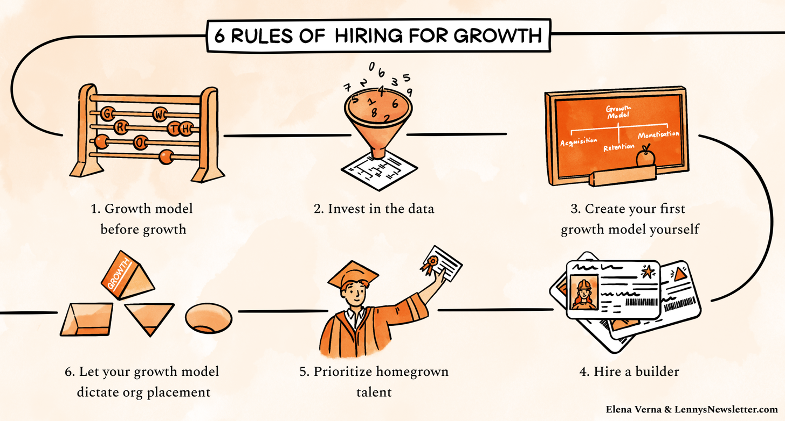

[https://www.lennysnewsletter.com/p/hiring-growth](https://www.lennysnewsletter.com/p/hiring-growth)

> ### **Rule 1: Growth model before growth**
>
> Great *products* have incredible product-market fit—they have correctly proved a compelling value hypothesis that describes why a customer is likely to use the product. Great *companies*, on the other hand*,* have product-market fit coupled with a strong **growth model**—predictable, sustainable, and defensible *strategies* that help achieve maximum distribution in the market. Just like a product, your growth model needs to be researched, built, launched, and iterated on. You won’t get it right immediately.
>
> A growth model is made up of two parts:
>
> 1. **Growth levers**
> 2. **Growth motions**
>
> **Growth levers** describe ways to impact your business’s revenue growth by making changes to your customers’ journey. Growth levers answer the following questions:
>
> 1. **Acquisition:** How do you acquire customers?
> 2. **Retention:** How do you activate and engage your customers?
> 3. **Monetization:** How do you monetize your customers?
>
> Every growth lever is leveraged through a **growth motion**. A growth motion describes which team or tactic is accountable for a successful outcome in the growth lever.

> ### **Rule 2: Invest in the data**
>
> Although the final desired output of any business is revenue, the levers that a team pulls to impact revenue sit deep within the user journey of your product. Understanding customer progression through a data lens will help you identify not only which growth lever you should prioritize, but where you should focus your efforts to yield the biggest short- or long-term impact.
>
> Whether you are a marketplace, SaaS, direct-to-consumer, social network, or any other type of business, **you can think of your data as a company organizational chart**:
>
> - Revenue is the “CEO” (it’s an outcome metric).
> - Acquisition, retention, and monetization are part of the “leadership team,” strategizing how to make the company successful.
> - Activation, engagement, conversion, etc. are the key “team members” that work tirelessly to deliver on outcomes for the company—these are the metrics your growth team will drive and impact.
> - “Chief of staff” is your North Star metric, which keeps close tabs on the “CEO,” working behind the scenes as a predictor to revenue success. 

> ### **Rule 3: Create the first growth model yourself**
>
> This is where you do *not* hire the Head of Growth. It is up to the core leadership team to figure out the first version of your growth model—the primary levers and motions that you believe will drive your business growth. Only you know all the nuances of the market, product, and customer, hence are best positioned to put together the first version of a growth model that will have the highest likelihood of success.
>
> It is important to understand that the initial growth model is a hypothesis with assumptions that are yet to be proven. Your team’s first order of business will be to *learn* about the validity of the assumptions.
>
> [Here’s a sample template](https://miro.com/app/board/o9J_lmREpH0=/) for what a growth model could look like: 

> ### **Rule 4: Hire a builder**
>
> ### **Rule 5: Prioritize homegrown talent**
>
> ### **Rule 6: Let your growth model dictate growth org placement**

> Growth models and growth teams are just as important to a successful business as strong product-market fit. There are many incredible products that you’ve never even heard about because they have not invested in their growth model and end up slowly dying. Conversely, there are a lot of terrible products with such strong growth models that they make a company incredibly successful.

> ### Helpful additional resources
>
> - [20VC podcast episode on the biggest mistakes you can make when hiring for growth](https://www.thetwentyminutevc.com/elena-verna/)
> - [Crystal Widjaja blog post on the journey to scale data](https://www.reforge.com/blog/scaling-data)
> - [Andrew Chen’s blog post on hiring for a Head of Growth](https://andrewchen-com.cdn.ampproject.org/c/s/andrewchen.com/hiring-head-of-growth/amp/)
> - [Reforge’s Growth Series course](https://www.reforge.com/growth-series)
