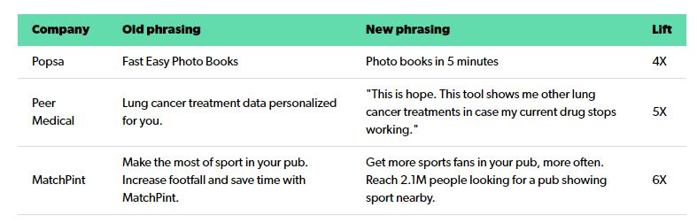

[https://review.firstround.com/finding-language-market-fit-how-to-make-customers-feel-like-youve-read-their-minds](https://review.firstround.com/finding-language-market-fit-how-to-make-customers-feel-like-youve-read-their-minds)

> Here’s a quick test: Which one of these headlines converted 10X better?
>
> 
>
> Option B converted visitors to signups 10X better (30%) than the first version (3%). Dozens of times now in my career as an operator, investor and advisor, I’ve seen changes in a handful of words yield jaw-dropping differences in conversion. More examples:
>
> 

> I myself didn’t realize until I jumped the wall from operator to VC and saw hundreds of early-stage companies, but now it’s clear as day: **language/market fit is the most under-appreciated concept for early-stage startups**.
>
> Yet there are real costs to not prioritizing this deeper work. Before language/market fit, growth feels like pushing on a string, a lot of work for incremental gains. Your Facebook ads barely pay for themselves and your AdWords don’t. Your marketers struggle to deliver results despite success with previous companies. Your salespeople (other than your founder) struggle to sell your product. And your conversion rates hover between 0.5% and 3%.
>
> On the other side, I’ve seen companies *with* language/market fit normally get conversion rates from 8% - 40%, which results in much stronger unit economics. Why the sudden jump? Visitors to your site or app store listing bring different levels of intent. It’s easy to convert high-intent users. But if you’re an unfamiliar startup, most of your visitors will have low intent, more curious than desperate. As you tighten up your language, you’ll be able to cut through to that massive pool of low-intent traffic.
>
> In my view, it’s the “lead domino,” the task that, once you get it right, makes everything easier. While low conversion rates are the most obvious symptom, language/market fit runs much deeper. It helps you understand and size your market, narrow in on what to build, validate demand and demonstrate traction, which can really help with hiring and fundraising. The business impact is abrupt, not gradual. It’s like picking a lock. And when it finally clicks, it’s thrilling. 

> ## **STEP ZERO: THE CASE FOR STARTING WITH FINDING LANGUAGE/MARKET FIT** 
>
> When you can understand and articulate your customers' goals and struggles and anxieties in simple, precise language, your developers and product teams will not have to guess at what to build. 
>
> As an unknown startup, it’s hard enough to even get people to read or click on your ads, let alone rewrite their beliefs or change habits.
>
> This effect is obvious in paid search. When people buy search terms, click rates are higher if the ad copy *exactly* matches the search query syntax, rather than a paraphrase.

> ## HOW TO FIND THE LANGUAGE THAT PICKS THE LOCK (OR WHY NOBODY WANTS YOUR “ALL-IN-ONE SOLUTION.”)
>
> A simple test: **If your headline completes the sentence “Our product is…” You’re** ***not\*** **using** ***their\*** **words. If your headline completes the sentence “Now you can ______” or “I wish I could _____” or “Someday I hope to _____” then your language might resonate**. [A good marketer](https://review.firstround.com/the-playbook-for-hiring-the-right-marketer-at-the-right-time-for-your-startup) will fill that “now you can” blank with exactly the right words. A few proven examples:
>
> 
>
> What seems like a simple purchase decision sits within a larger context in the customers' lives. And as marketers, that context is critical, because the words in their heads will reflect *their situation* rather than your product.
>
> 1. Uncover the struggles, hidden assumptions and goals via interviewing recent sign-ups
>
>    If this seems overwhelming, we created these [interview “cheat sheet” cards](https://www.startupcorestrengths.com/jtbd-insights-canvas) with question prompts, which simplify the process. Also, to watch a hands-on demonstration of how to run a Jobs interview, [check out this workshop run by Bob Moesta and Chris Speck](https://businessofsoftware.org/2014/06/bos-2013-bob-moesta-and-chris-spiek-uncovering-the-jobs-to-be-done/).
>
> 2. Draft some test messages based on the interview transcripts
>
> 3. Validate comprehension qualitatively
>
> 4. Finally, test the language quantitatively

