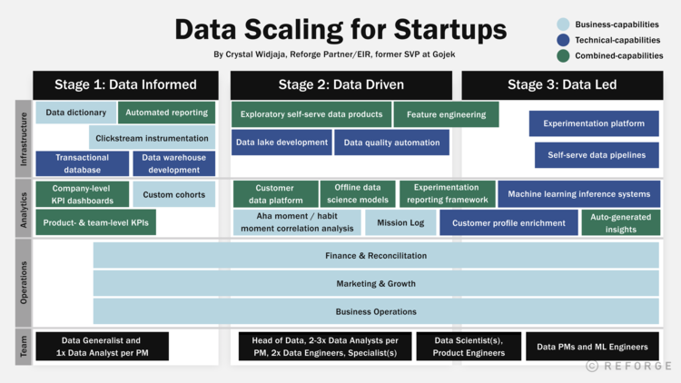

[https://www.reforge.com/blog/scaling-data](https://www.reforge.com/blog/scaling-data)

> Instead, ***data needs to be seen as a strategic lever for growth\***.  Viewing data from this perspective leads to different answers on the questions we started with around team and tools.  What does it look like when data is treated as a strategic lever for growth?  I recommend walking through four areas:
>
> 1. **Strategy -** What are your points of leverage? How does data improve those points of leverage?
> 2. **Stage -** What stage of maturity is our product in? What stage of maturity is our Data in?
> 3. **Team -** What people do we need to achieve the data strategy? Are they set up for success internally?
> 4. **Tools -** What tools do we need to adopt to facilitate the team's impact?

> ## Strategy: What are your points of leverage?
>
> Everyone thinks they need to have a highly scalable, mature data organization. The reality is that most businesses don’t have the necessary scale to build advanced ML-led capabilities that could meaningfully impact the business. The answer to questions like “*when do I need a data scientist?*” really starts with an objective reflection of the [company’s strategy, roadmap, and goals](https://www.reforge.com/blog/the-product-strategy-stack):
>
> - How much data do the product and business operations generate each day?
> - How can customer value props be improved by leveraging data?
> - What kinds of decisions could the data help inform today?
> - How could decision-making change if we had 1000x the data?
> - How much more efficient could business operations be with data automation?
>
> It's more about identifying the right points of leverage — and not just jumping to the end because you think everything else will come as a result of it.
>
> Going through some of the above questions tends to reveal some uncomfortable truths. The most common one is that **the company doesn't have enough data** for advanced data infrastructure to be impactful to a company’s business operations. Even the most sophisticated data science team and infrastructure will fail to add value to a business that just isn’t generating enough usable data — there aren’t enough signups, retained users, or actions in the product for meaningful data science solutions to exist.

> ## The Three Stages Of Scaling Data
>
> 
>
> Most companies can fit themselves into one of three stages:
>
> - **Stage 1: Data Informed.** These companies are focused on building the business and getting to product-market-fit (stable user retention rates). The key business need is for data to provide operational visibility.
> - **Stage 2: Data Driven.** These companies have reached product-market-fit and are actively optimizing for specific users, behaviors, and experiences in the product at the feature-level. The key business need is for data to support the organization’s growth with scalable tooling, data products, and deep-dive insights.
> - **Stage 3: Data Led.** These companies are operationally run by data products, infrastructure, and services. The key business need is the “productization” of data services that unlock Product and Data Science teams, allowing them to automate operational decision-making and user product experiences.
>
> **Note: Not all companies need to become Data Led.**

> ## Stage 1: Data Informed
>
> **Data Informed Business Needs**
>
> - Business health monitoring
> - Visibility of product KPIs/success metrics
> - Functional operations support for a handful of multi-disciplinary individuals and ICs
> - Getting to product-market fit (flattened retention rates across cohorts)
> - Metrics definitions and alignment
>
> **Data Informed Capabilities**
>
> - Reliable availability of transactional and financial data
> - Off-the-shelf data visualization, integration, and tooling
> - Broad organizational understanding of unique user, retention, and monetization metrics through the use of company level KPI dashboards
> - Aligned metric definitions through the use of a data dictionary

> ## Stage 2: Data Driven
>
> ***Organizations at this stage leverage the Data team for decision-making guidance, as opposed to operational data retrieval and visibility.\*** To improve data-driven decision making, the organization must have some self-serve access to information, comprehensive insights that answer **why something is happening (not just what is happening)***, and an early set of productized data products that unlock operational capabilities.
>
> **Data Driven Business Needs**
> - Feature-level product optimization
> - Smarter & faster function-specific business operations (sales, customer service, ops)
> - Data-informed decision-making guidance on marketing campaigns, growth tactics, and support operations
> - Expanded monetization of core & [adjacent users](https://andrewchen.com/the-adjacent-user-theory/)
>
> **Data Driven Capabilities**
> - Proactive data governance policies
> - Scalable data warehouse infrastructure and tooling through a data lake, customer data platform, and more
> - Self-serve analytics tools
> - Org-wide experimentation and decision-making guidance through experimentation tooling and a reporting framework.

> ## Thoughtful sequencing, not all-at-once
>
> A key to success is to not try and enable a stage all at once.  At a high-level, infrastructure and analytics must be balanced between two things:
>
> 1. Unlocking product insights and business capabilities
> 2. Scaling data operations and infrastructure
>
> **It is a constant process of identifying business needs, building the necessary capabilities, and seeing it unlock growth, which leads to new business needs.**
