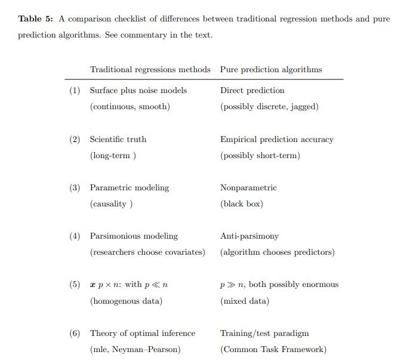

[https://www.tandfonline.com/doi/abs/10.1080/01621459.2020.1762613](https://www.tandfonline.com/doi/abs/10.1080/01621459.2020.1762613)

[https://efron.ckirby.su.domains/papers/2019PredictEstimatAttribut.pdf](https://efron.ckirby.su.domains/papers/2019PredictEstimatAttribut.pdf)

> The scientific needs and computational limitations of the twentieth century fashioned classical statistical methodology. Both the needs and limitations have changed in the twenty-first, and so has the methodology. Large-scale prediction algorithms—neural nets, deep learning, boosting, support vector machines, random forests—have achieved star status in the popular press. They are recognizable as heirs to the regression tradition, but ones carried out at enormous scale and on titanic datasets. How do these algorithms compare with standard regression techniques such as ordinary least squares or logistic regression? 
>
> Several key discrepancies will be examined, centering on the differences between prediction and estimation or prediction and attribution (significance testing). Most of the discussion is carried out through small numerical examples.

