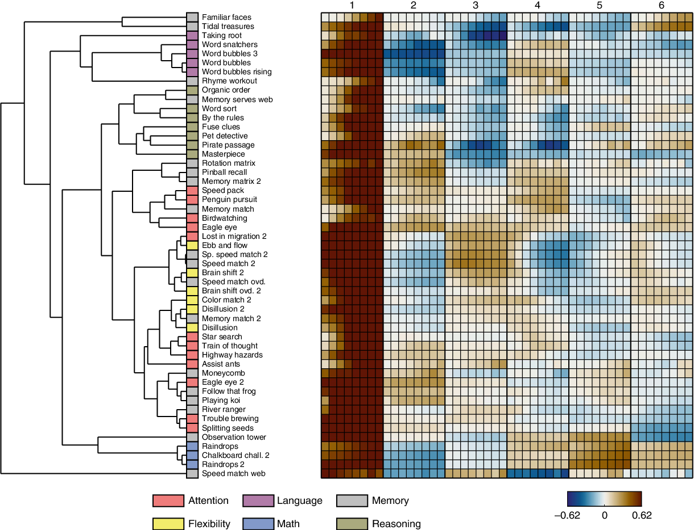
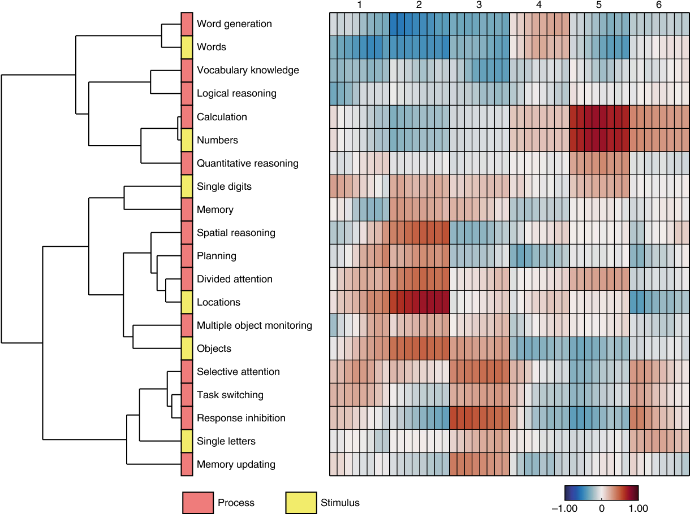
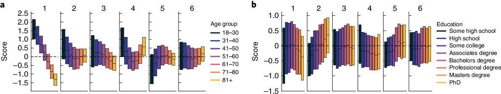

[https://www.nature.com/articles/s41562-020-00935-3](https://www.nature.com/articles/s41562-020-00935-3)

[https://www.youtube.com/watch?v=BzX8I4Z39Qg](https://www.youtube.com/watch?v=BzX8I4Z39Qg)

> The flexibility to learn diverse tasks is a hallmark of human cognition. To improve our understanding of individual differences and dynamics of learning across tasks, we analyse the latent structure of learning trajectories from 36,297 individuals as they learned 51 different tasks on the Lumosity online cognitive training platform. 
>
> Through a data-driven modelling approach using probabilistic dimensionality reduction, we investigate covariation across learning trajectories with few assumptions about learning curve form or relationships between tasks. Modelling results show substantial covariation across tasks, such that **an entirely unobserved learning trajectory can be predicted by observing trajectories on other tasks.** 
>
> The latent learning factors from the model include a general ability factor that is expressed mostly at later stages of practice and additional task-specific factors that carry information capable of accounting for manually defined task features and task domains such as attention, spatial processing, language and math.

> **Lumosity cognitive training data**. This [OSF repository](https://osf.io/g9zkf/) This repository contains the data from: *Steyvers, M, and Schafer, B. (in press). Inferring Latent Learning Factors in Large-Scale Cognitive Training Data, Nature Human Behaviour*. The data set includes the gameplay data for over 36K users across 50+ cognitive tasks. The raw data contains performance scores at the gameplay level and do not include the individual decisions made within a particular gameplay.
>
> **Lumosity Task Switching Data and Modeling Code**. This [OSF repository](https://osf.io/sxr5f/) contains the data and code from: Steyvers, M, Hawkins, G., Karayanidis, F. and Brown, S. (2019). The Dynamics of Task Switching: Modeling Practice and Age Effects in Large-Scale Data. *Proceedings of the National Academy of Sciences*. The data set that we are working with includes the gameplay data for a sample of users who play [Ebb and Flow](https://www.lumosity.com/app/v4/games/ebb-and-flow), a task switching game on [Lumosity](https://www.lumosity.com/en/). This is a game designed to test the ability to switch between different tasks. The raw data is described at the individual trial level (i.e., individual decisions within a particular gameplay event) and include response time, accuracy, as well as identifiers that describe the particular stimulus display and type of condition associated with the trial.

