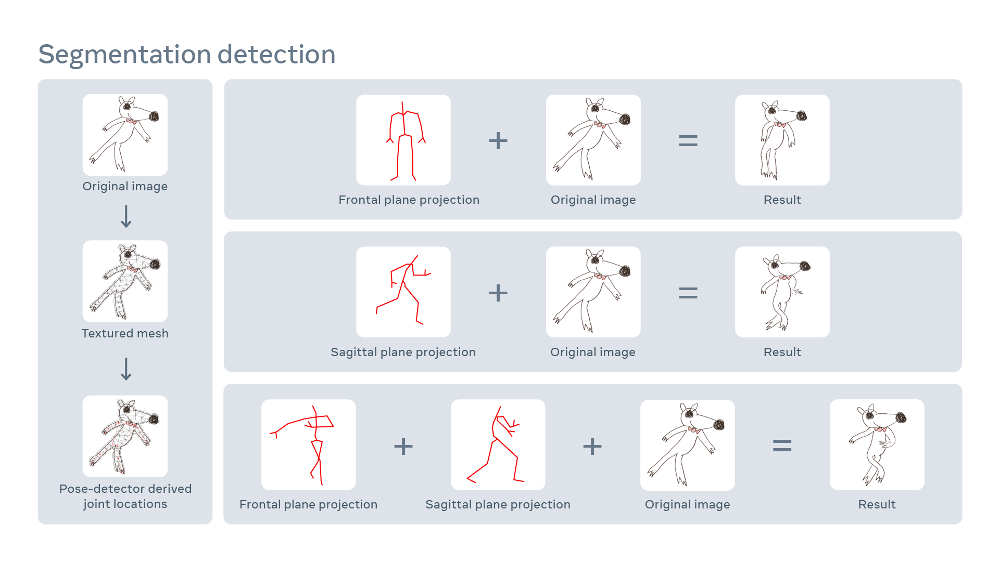

[https://ai.facebook.com/blog/using-ai-to-bring-childrens-drawings-to-life](https://ai.facebook.com/blog/using-ai-to-bring-childrens-drawings-to-life)

> We’re excited to announce a first-of-its-kind method for automatically animating children’s hand-drawn figures of people and humanlike characters (i.e., a character with two arms, two legs, a head, etc.) that [bring these drawings to life](https://l.facebook.com/l.php?u=https%3A%2F%2Fsketch.metademolab.com%2F%3Ffbclid%3DIwAR1d3oAHzu06Byx6RVAUvmDzP9noYPRC2rQlk1Isnva9G0FfuBPBMa6t0L0&h=AT3YwGlGBz8LElpgd6HqEVU8J28yGzmYWTGm5gNlwgSGDTJkqthDx8Nc6ufoROrE5EvQriLyWBD-mItzvpskm8nfjAKPI7RuwxdcZoIOPEtPqPDuO2YinQLyNngOk7LGLI57HVpQNR1h54lGN0qyXA) in a matter of minutes using AI. By uploading them to our prototype system, parents and children can experience the excitement of watching their drawings become moving characters that dance, skip, and jump. And they can even download their animated drawings to share with friends and family. If parents choose, they can also submit those drawings to help improve the AI model.

