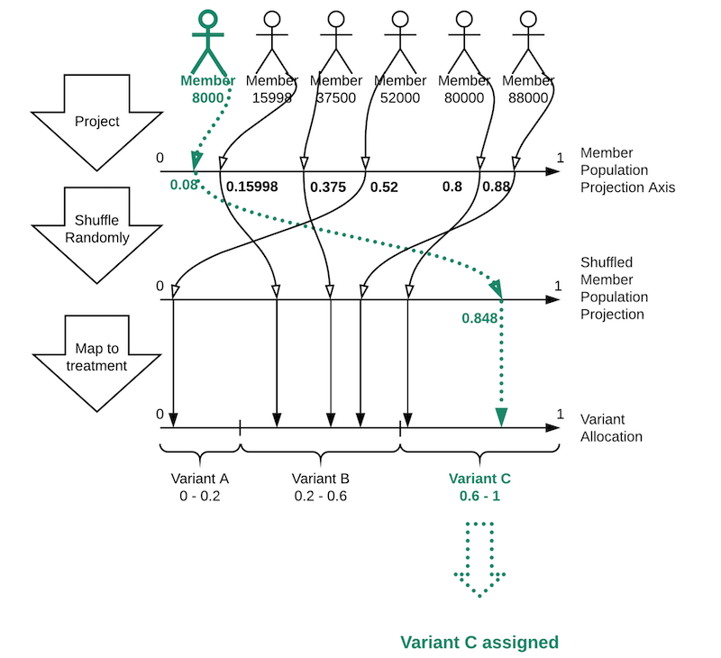
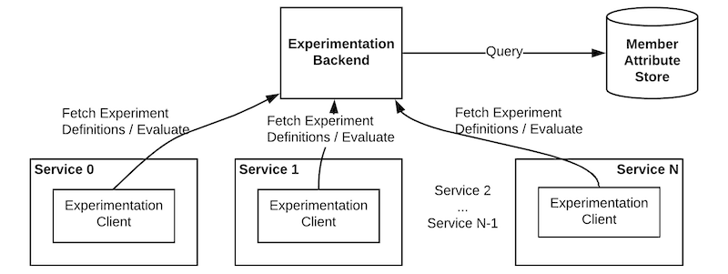

[https://engineering.linkedin.com/blog/2020/a-b-testing-variant-assignment](https://engineering.linkedin.com/blog/2020/a-b-testing-variant-assignment)

> The validity of A/B testing is rooted in the assumption that each variant is assigned to a random member. That’s why it’s critical to find a good randomization algorithm. There are three main characteristics of a good variant assignment function:
>
> 1. Assignment of variants to members happens according to the desired split (i.e., no sample size ratio mismatch)
> 2. Variant assignment of a single member is deterministic (i.e., repeatable)
> 3. No correlation between the assignments when there are multiple experiments running
>
> In particular, the third characteristic is critical because it suggests that a member’s assignment in one experiment has no effect on the probability of being assigned to a variant in other experiments. This is important because we want to analyze each experiment separately. We will talk more about this characteristic when we go through an example below.

> **Use hashing.** The variant can also be retrieved via hashing. Such a method requires the defining of a family of hash functions HASH(test_id): memberId -> [0, 1) where:
>
> - each of the functions maps a space of member ids uniformly into [0, 1),
> - “salt” is a constant, unique value chosen for each A/B test (in the above example, the test_id),
> - any two distinct functions from the family should generate independent distributions of the projection points.
>
> Such a family of hash functions could be created from a common crypto digest function FCrypt: byte_array -> [0, F_MAX], where F_MAX is the largest value returned by the function and [0, F_MAX) is an integer range. This entails the following steps:
>
> 1. Remap the function into [0, 1) by applying HASH(bytes) = F(bytes) / F_MAX.
> 2. Encode “salt” as a fixed-width byte prefix (e.g., a 4-byte prefix to make sure that it will be able to fit all possible values of salt).
> 3. Encode member_id as a variable-size byte array.
> 4. Then HASH(salt)(member_id) = FCrypt(concat(prefix(salt, 4), bytes(member_id)).

> ## Choosing the best method
>
> The hash-based variant assignment approach is one of the cornerstones of LinkedIn’s experimentation system.
>
> On the other hand, the hash-based assignment approach is deterministic and enables us to use an advanced form of caching with about 99.98% requests being evaluated in application instances, and only a mere 0.02% of evaluations resulting in network requests to the experimentation backend using the following topology:
>
> Such a great locality of evaluations is made possible by caching the experiment definitions within each service running A/B tests and being able to process variant evaluations rules in the experimentation engine, which is a part of the A/B client library:
>
> At LinkedIn, we apply MD5 hash function to the combination of member id and experiment identifier. MD5 hash function has also been tested in Chi-squared tests to satisfy the independent assignment characteristic.

