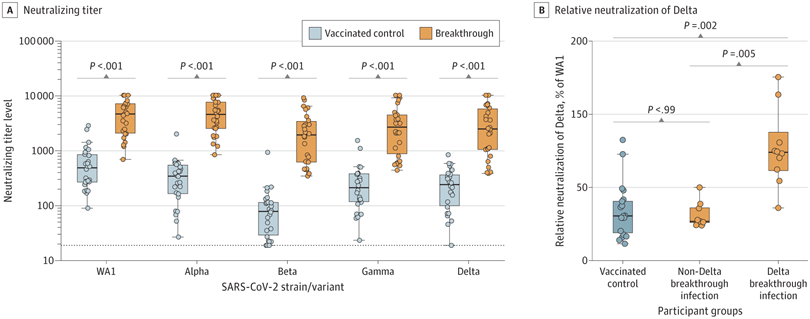

[https://jamanetwork.com/journals/jama/fullarticle/2787447](https://jamanetwork.com/journals/jama/fullarticle/2787447)

> Results of this study showed substantial boosting of humoral immunity after breakthrough infection, despite predominantly mild disease. Boosting was most notable for IgA, possibly due to the differences in route of exposure between vaccination and natural infection. In addition, breakthrough sera demonstrated improved variant cross-neutralization, and Delta breakthrough infections in particular exhibited improved potency against Delta vs WA1, suggesting that the protective immune response may be broadened through development of variant boosters with antigenic inserts matching the emerging SARS-CoV-2 variants.

One twitter summary: [https://twitter.com/GKMizuno/status/1478229795120893955](https://twitter.com/GKMizuno/status/1478229795120893955)

> It stands to reason, therefore, the best protection against all SARS-CoV-2 variants will be 3rd dose + Omicron infection. This is implied by earlier OHSU research paper of breakthrough infections -- [https://jamanetwork.com/journals/jama/fullarticle/2787447](https://jamanetwork.com/journals/jama/fullarticle/2787447)

