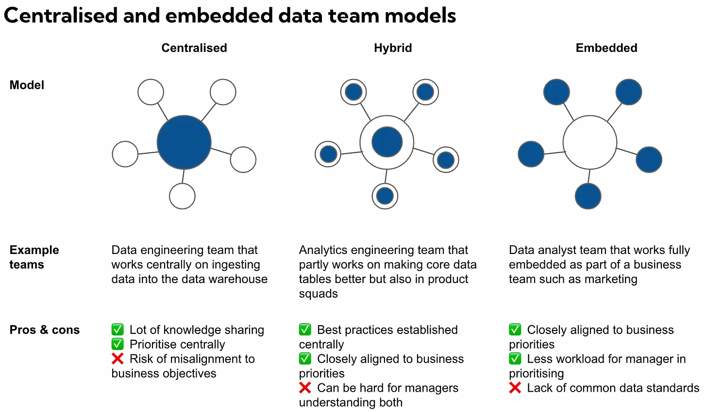

[https://mikkeldengsoe.substack.com/p/data-team-structure-embedded-or-centralised](https://mikkeldengsoe.substack.com/p/data-team-structure-embedded-or-centralised)

> ## Should my data team operate centralised or embedded? 
>
> Some teams naturally tie themselves to being centralised. Data engineers for example benefit from working on shared objectives such as improving data pipelines or tooling. Analysts with domain expertise in credit modelling may tie themselves better to being fully embedded and working as part of a business function.
>
> Here are some simple guidelines I have seen work in the past.
>
> Find your team stretched thin across too many stakeholders, bogged down by ad-hoc requests and constantly having to take shortcuts when it comes to data quality? Then perhaps it is time to work more centralised.
> 
> Find yourself with a centralised growing data team but having a hard time keeping context on all the business areas you support with stakeholders complaining that data people are not close enough to business problems? Then maybe it’s time to decentralise. 
>
> In reality you’ll often have to alternate between the two models and what worked well six month ago may no longer be the right model if the team or priorities have changed.

