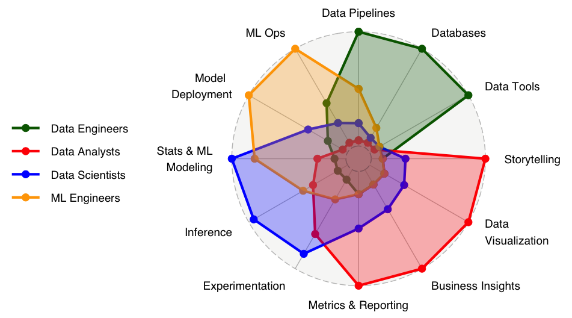

[https://www.datacaptains.com/blog/guide-to-data-roles](https://www.datacaptains.com/blog/guide-to-data-roles)

> **Data Engineers**
>
> Data Engineers are responsible for architecting and maintaining databases, building pipelines that move the data through different sources and systems, and developing tools used by the company for analytics, dashboarding, and, eventually, ML.
>
> **Data Analysts**
>
> This role is responsible for translating data into analyses and business insights. Analysts are typically SQL experts and partner with many other functions to translate cold numbers into a story that can be leveraged for business decisions. Other important skills include: descriptive statistics, metrics definition, data visualization, presentations & storytelling, problem solving, product intuition, stakeholder management. Depending on the domain, this title can further specialize: “Data Science, Analyst”, “Product Analyst”, “Business Analysts”, “Business Intelligence Analyst” and more.
>
> **Data Scientists**
>
> Data Science has become a catch-all term in the data world. It is the most recognized title and, yet, its meaning has been changing over time. A popular alternative nowadays is “Research Scientist”. This role’s responsibility is to research and apply advanced statistical techniques such as regression, classification, clustering, optimization to automate processes that impact business operations or customer facing products. They typically partner with Software Engineers or ML Engineers for the deployment and monitoring of their models. Data Scientists also apply inferential and experimental techniques to choose among different versions of a product or a process.
>
> **Machine Learning Engineers**
>
> Machine Learning Engineers (alternatively “Applied Scientists”) have some overlap with Data Scientists when it comes to researching advanced models for the automation of processes. What typically distinguishes ML Engineers from other roles is their ability to design efficient algorithms for the proposed solutions, deploy and manage them with [ML Ops](https://en.wikipedia.org/wiki/MLOps) techniques, and monitor their performance over time.

