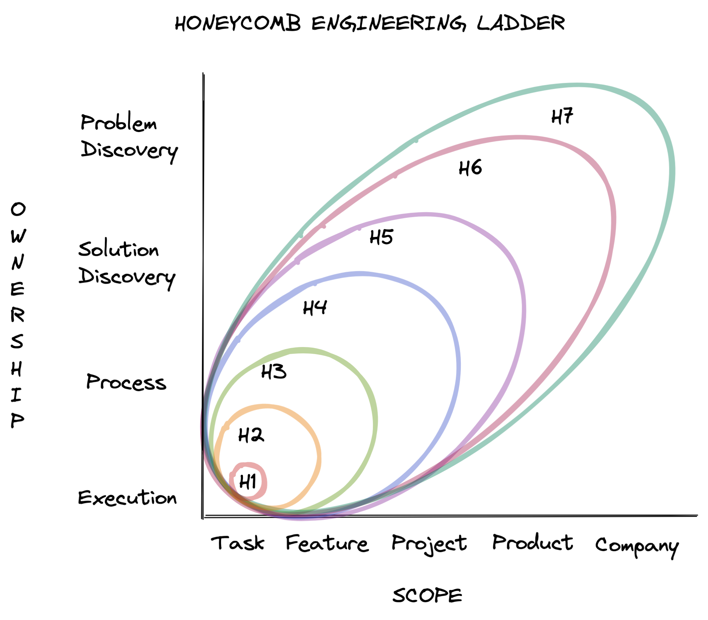

[https://www.honeycomb.io/blog/engineering-levels-at-honeycomb/](https://www.honeycomb.io/blog/engineering-levels-at-honeycomb/)

> It has been seven years since Rent the Runway[ posted their engineering ladder](https://dresscode.renttherunway.com/blog/ladder), kicking off a veritable trend of engineering teams open sourcing their ladders. Interestingly, nearly all of them seem to have coalesced around “area of scope” as a useful proxy for level.
>
> While talking about scope, one of our Staff Engineers, Max Edmands, suggested we look at the[ PSHE framework](https://www.theproductfolks.com/blog/lessons-for-product-leaders-shishir-mehrotra). PSHE (problem, solution, how, and execution) came from YouTube’s product team when they grappled with this very same problem, promotions tied to scope. This drove them to add a second dimension to their career ladder, which they called PSHE (others have identified similar progressions such as[ Implementers, Solvers, and Finders](https://rkoutnik.com/2016/04/21/implementers-solvers-and-finders.html)). In both cases, the insight gleaned is that career progression happens over wider areas of both scope *and* ownership.
>
> - Scope progresses from focusing on tasks to features to projects, products, and the company as a whole.
> - Ownership progresses from focusing on the execution of work to the process of delivering work, to the discovery of solutions to deliver, to the discovery of problems to solve.

> ## Tool #1: Engineering ladder diagram
>
> Some aspects of our ladder may be familiar to you, like how the gap between levels increases as you move up the ladder. “Senior engineer” (H5) is a “terminal level” for us, which sounds extreme, but it just means "you don’t have to advance beyond this level." While our ladder continues above the senior level, many very talented engineers stay at H5 because they are happy and still create the impact at Honeycomb that leaves them fulfilled. But for engineers at lower levels, there is an expectation of growth rooted in the support, coaching, mentorship, and sponsorship to realize their growth potential.
>
> ## Tool #2: Growth framework based on scope & ownership
>
> The other visualization depicts our new growth framework based on scope and ownership. We wanted to communicate that each level on the ladder is a superset of the previous levels and that there are a variety of ways to operate at any given level. 

