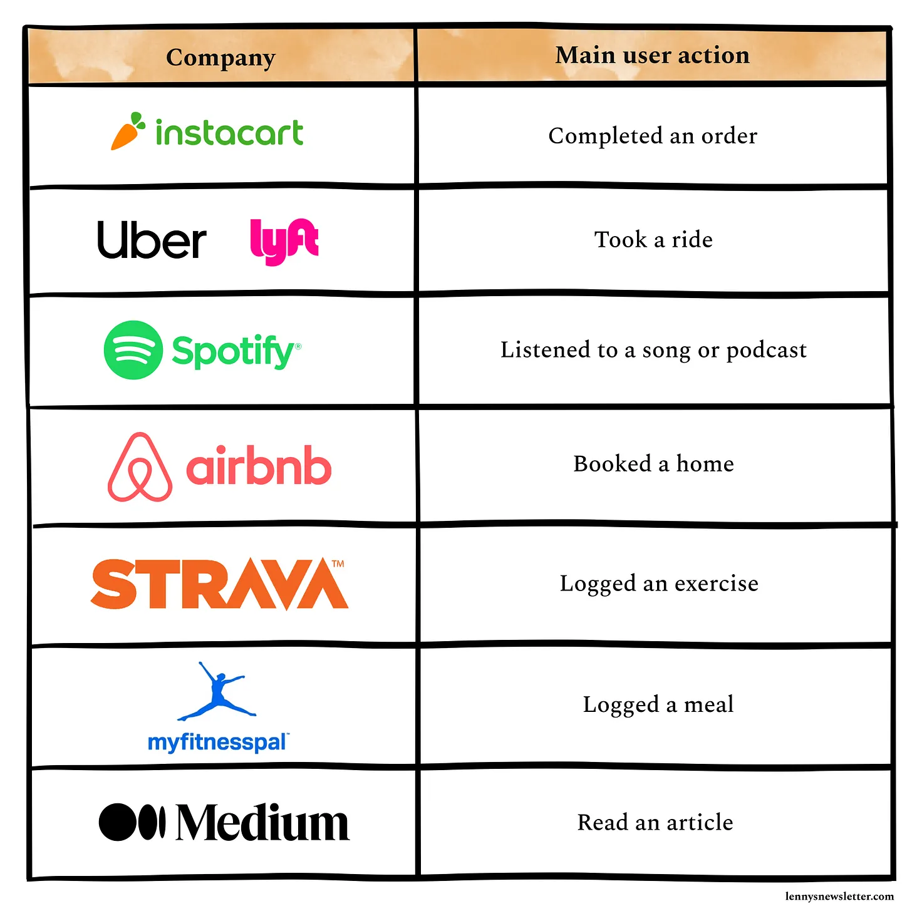

[https://www.lennysnewsletter.com/p/measuring-cohort-retention](https://www.lennysnewsletter.com/p/measuring-cohort-retention)

> ## **Step 1. Define “active”**
>
> Most companies use logins or app opens as main events for the “active users” definition. But given that I always aim for the cleanest and most precise data reporting, **I’d recommend using the main user action as the activity event**, for example:
>
> **Pros to this approach:** 
>
> 1. It ignores all the “noise” events, like visits, screen views, and logins, and tailors the activity event to only the main transaction or event that you expect a user most commonly does.
> 2. It gives you the cleanest sample of truly active users, whose behavior you can monitor and validate.
> 3. It is usually available across all platforms (unlike app open or visits) and data sources, making it easily accessible for reporting and monitoring.
>
> Regardless of your business type, **my recommendation is to use the main user action to monitor not only retention but other user activity metrics like DAU, WAU, MAU, and DAU/MAU ratio.** 

> ## **Step 2. Differentiate users from customers**
>
> Once your team agrees on what “active” means for your product, the next step is to segment your active users into free vs. paid. Your retention will have a different logic for each of these groups.
>
> > #### “A customer is defined as the person/group who is paying you. A user is a person using the product. In subscription products, oftentimes there are multiple users associated with a single customer. Or people are users before they are customers. You need to separate the definition and language between these two things for teams to clearly act on them.” —[Brian Balfour, “Common Mistakes in Defining Metrics”](https://brianbalfour.com/quick-takes/common-mistakes-defining-metrics)
>
> Often a mistake I see SaaS companies make is reporting one “blended” retention, with a mix of free and paid users. This can be misleading, because users who pay for the product are likely to use it way more than free users. So the true activity of free users (and your “pool of opportunity” to convert) will be hidden.

> ## **Step 3. Pick your retention type**
>
> The next step in calculating retention is setting your timeline. As a team, you have to agree on what retention reporting type you should adopt:
>
> 1. **X-day retention**: X-day (also known as N-day or bounded) tells you the percentage of users who come back on a specific day. For example, for all users who join, what percentage return to your app on exactly day 14:
> 2. **Unbounded (rolling) retention**: Unbounded retention tells you how many of your users got back on a specific day *or later*. For example, for all new users who joined on a specific day, what percentage of users are using the product after 14 days (and not necessarily on day 14). 
>
> The method you choose will significantly affect your results.
>
> My general favorite method is unbounded retention because (1) I like my KPIs to be connected, proportional, and correlated to each other, and (2) unbounded retention is the inverse of churn, so it gives me another way to validate and test my data, increasing the confidence in my reporting (the higher the churn, the lower the retention, and vice versa).
