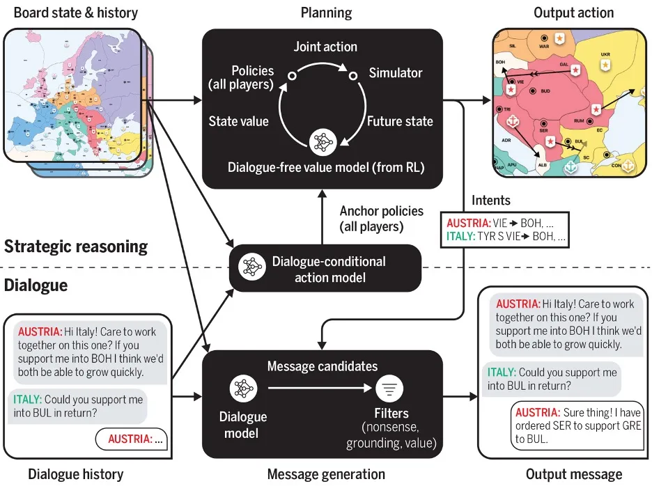

[https://garymarcus.substack.com/p/what-does-meta-ais-diplomacy-winning](https://garymarcus.substack.com/p/what-does-meta-ais-diplomacy-winning)

Human-level play in the game of Diplomacy by combining language models with strategic reasoning (FAIR et al., 2022) https://www.science.org/doi/10.1126/science.ade9097

> Diplomacy, a complex game that requires extensive communication, has been recognized as a challenge for AI for at least [fifty years](http://www.bitsavers.org/pdf/mit/ai/aim/AIM-250.pdf). To win, a player must not only play strategically, **but form alliances, negotiate, persuade, threaten, and occasionally deceive**. It therefore presents challenges for AI that are go far beyond those faced either by systems that play games like Go and chess or by chatbots that engage in dialog in less complex settings.
>
> The results themselves are, without question, genuinely impressive. Although the AI is not yet at or near world champion level, the system was able to integrate language with game play, in an online version of blitz Diplomacy, ranking within the top 10% of mixed crowd of professional and amateurs, with play and language use that were natural enough that only one human player suspected it of being a bot.

> The first thing to realize is that Cicero is a very complex system. Its high-level structure is considerably more complex than systems like AlphaZero, which mastered Go and chess, or GPT-3 which focuses purely on sequences of words.  Some of that complexity is immediately apparent in the flowchart; whereas a lot of recent models are something like data-in, action out, with some kind of unified system (say a Transformer) in between, Cicero is heavily prestructured, in advance of any learning or training, with a carefully-designed bespoke architecture that is divided into multiple modules and streams, each with their own specialization.

