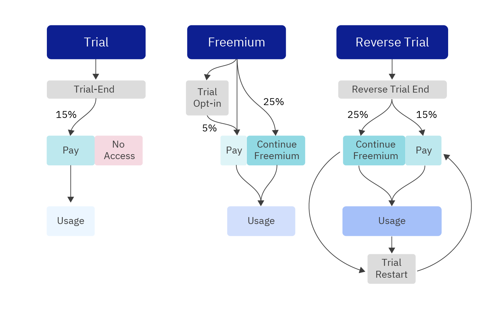

[https://amplitude.com/blog/reverse-trial](https://amplitude.com/blog/reverse-trial)

> Trial or freemium? It’s an age-old question for [product-led growth companies](https://amplitude.com/blog/product-led-growth-companies). Well, I say, neither. You can capture the best of both worlds with a **reverse trial**.
>
> A reverse trial gives customers access to paid features and puts them on a freemium plan when the trial ends. The result? You can drive the conversions trials inspire *and* the product usage freemium plans are known for.
>
> - While **trials** encourage conversions, low usage can prevent widespread brand advocacy, and a trial might not be long enough for users to derive value from more advanced features.
> - **Freemium** plans bring in more product usage and feed your growth loops so you can invest more in your product and less in marketing, but they struggle to drive monetization awareness and have lower paid conversion rates.
> - **Reverse trials** combine the two strategies to drive paid conversions and product usage simultaneously.
>
> Using a reverse trial, you get more participants in your growth loops. You may get the 15% conversion rate of the free trial model *and* drive product usage with the 25% that continues on a freemium plan.

