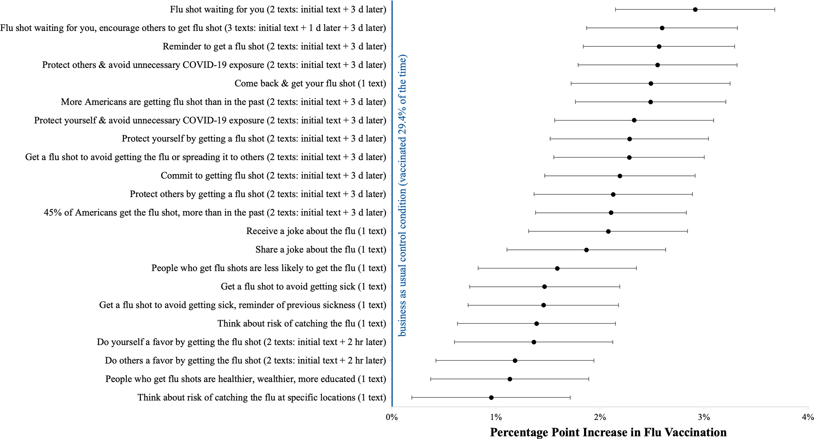

[https://www.pnas.org/doi/10.1073/pnas.2115126119](https://www.pnas.org/doi/10.1073/pnas.2115126119)

> Encouraging vaccination is a pressing policy problem. To assess whether text-based reminders can encourage pharmacy vaccination and what kinds of messages work best, we conducted a megastudy. 
>
> We randomly assigned 689,693 Walmart pharmacy patients to receive one of 22 different text reminders using a variety of different behavioral science principles to nudge flu vaccination or to a business-as-usual control condition that received no messages. 
>
> We found that the reminder texts that we tested increased pharmacy vaccination rates by an average of 2.0 percentage points, or 6.8%, over a 3-mo follow-up period. 
>
> The most-effective messages reminded patients that a flu shot was waiting for them and delivered reminders on multiple days. **The top-performing intervention included two texts delivered 3 d apart and communicated to patients that a vaccine was “waiting for you.”** 
>
> **Neither experts nor lay people anticipated** that this would be the best-performing treatment, underscoring the value of simultaneously testing many different nudges in a highly powered megastudy.

> The first- and second-best-performing messages in our megastudy repeatedly reminded patients to get a vaccine and stated that a flu shot was “waiting for you.”[§](https://www.pnas.org/doi/10.1073/pnas.2115126119#fn9) This aligns with prior research suggesting multiple reminders can help encourage healthy decisions ([13](https://www.pnas.org/doi/10.1073/pnas.2115126119#core-r13)). 
>
> Remarkably, the three top-performing text messages in a different megastudy, which included different intervention messages encouraging patients to get vaccines at an upcoming doctor’s visit, similarly conveyed to patients that a vaccine was “reserved for you.” ([8](https://www.pnas.org/doi/10.1073/pnas.2115126119#core-r8))

