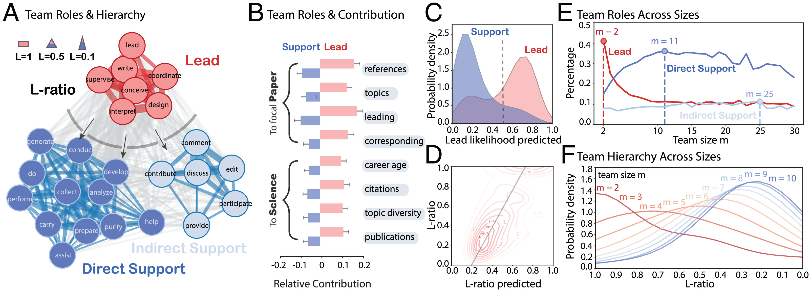

[https://www.pnas.org/doi/10.1073/pnas.2200927119](https://www.pnas.org/doi/10.1073/pnas.2200927119)

> With teams growing in all areas of scientific and scholarly research, we explore the relationship between team structure and the character of knowledge they produce. 
>
> Drawing on 89,575 self-reports of team member research activity underlying scientific publications, we show how individual activities cohere into broad roles of 1) leadership through the direction and presentation of research and 2) support through data collection, analysis, and discussion. 
>
> The hidden hierarchy of a scientific team is characterized by its lead (or L) ratio of members playing leadership roles to total team size. The L ratio is validated through correlation with imputed contributions to the specific paper and to science as a whole, which we use to effectively extrapolate the L ratio for 16,397,750 papers where roles are not explicit. 
>
> We find that, relative to flat, egalitarian teams, tall, hierarchical teams produce less novelty and more often develop existing ideas, increase productivity for those on top and decrease it for those beneath, and increase short-term citations but decrease long-term influence. 
>
> These effects hold within person—**the same person on the same-sized team produces science much more likely to disruptively innovate if they work on a flat, high-L-ratio team**. These results suggest the critical role flat teams play for sustainable scientific advance and the training and advancement of scientists.

> Tall teams provide obvious benefits for scientists who lead them, but do not necessarily maximize the productivity and innovation potential of those who support. They enable greater lead author productivity, maximize immediate citations, and so hedge against the lead author’s risk of not receiving academic credit ([14](https://www.pnas.org/doi/10.1073/pnas.2200927119#core-r14)).

> Concerns over scientific stagnation have arisen from apparent diminishing returns to scientific investment, inferred from accelerated growth in publications but slowed expansion in new ideas ([15](https://www.pnas.org/doi/10.1073/pnas.2200927119#core-r15)). Here we reveal the place of team hierarchy in the landscape of innovation, and provide insight for funding agencies about the critical role flat teams play in advancing supporting scientists to grow the next-generation scientific workforce for sustainable, long-term scientific advance.

