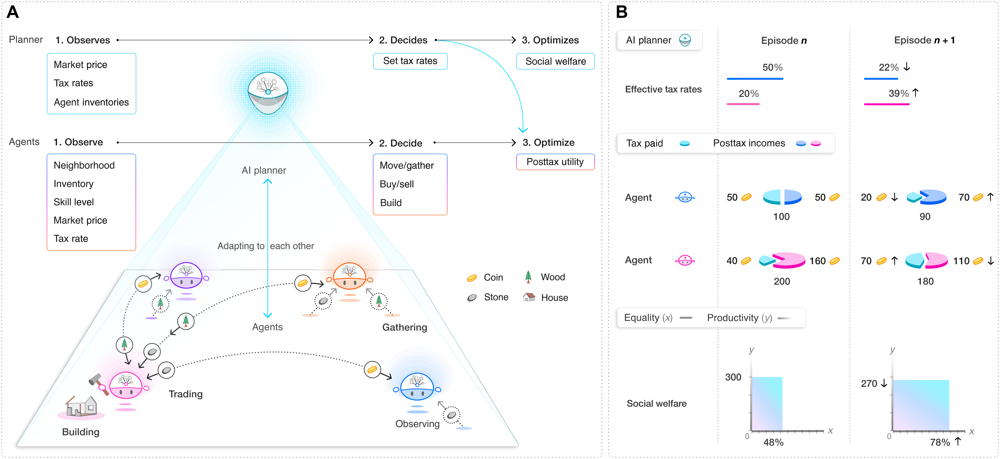

[https://www.science.org/doi/full/10.1126/sciadv.abk2607](https://www.science.org/doi/full/10.1126/sciadv.abk2607)

Simulation code and analysis: https://zenodo.org/record/5644182

> Artificial intelligence (AI) and reinforcement learning (RL) have improved many areas but are not yet widely adopted in economic policy design, mechanism design, or economics at large. 
>
> The AI Economist is a two-level, deep RL framework for policy design in **which agents and a social planner coadapt**. In particular, the AI Economist uses structured curriculum learning to stabilize the challenging two-level, coadaptive learning problem. 
>
> We validate this framework **in the domain of taxation**. In one-step economies, the AI Economist recovers the optimal tax policy of economic theory. In spatiotemporal economies, the AI Economist substantially improves both utilitarian social welfare and the trade-off between equality and productivity over baselines. **It does so despite emergent tax-gaming strategies while accounting for emergent labor specialization, agent interactions, and behavioral change**. 
>
> These results demonstrate that two-level, deep RL complements economic theory and unlocks an AI-based approach to designing and understanding economic policy.

> We use both a single-step economy and Gather-Trade-Build, a multistep, microfounded economic simulation. Gather-Trade-Build features multiple heterogeneous economic agents in a two-dimensional spatial environment. Productivity and income elasticity emerge as the result of the strategic behavior of multiple agents, rather than from statistical assumptions. Moreover, Gather-Trade-Build includes trading between agents and simulates an economy over extended periods of time, i.e., spanning 10 tax periods, each of 100 days. Hence, the dynamics of Gather-Trade-Build are more complex than those considered in traditional tax frameworks and serve as a rich test bed for AI-driven policy design.

> The AI Economist framework provides numerous advantages.
>
> 1. It does not suffer from the Lucas critique. By design, it considers actors who coadapt with economic policy.
> 2. Rather than behavioral rules, the use of RL provides for rational agent behavior.
> 3. The simulation framework is flexible, supporting a configurable number of agents and various choices in regard to economic processes.
> 4. The designer is free to choose any policy objective, and this does not have to be analytically tractable or differentiable.
> 5. RL agents can learn tabula rasa and do not strictly require prior knowledge about the structure of the economic simulation (although prior knowledge may accelerate learning). Rather, they can discover the structure of the simulation through interaction during learning.

> From an economic point of view, the planner aims to find the tax rates that maximize social welfare, subject to the best-response constraint that the behavior of agents maximizes their utility given the tax rates. From an RL point of view, a planner that learns in effect adjusts agent reward functions because taxes influence the posttax income that agents receive as a result of payments and redistributions. As the tax schedule changes, the optimal behavior for agents changes. This instability is exacerbated by mutual exploration.

> Curriculum learning starts learning with easy problems and gradually increases the difficulty. In our setting, curriculum learning effectively staggers agent and planner learning to let agents adapt to a wide range of (random) tax schedules before the planner starts to learn. In particular, we first gradually introduce labor costs and then taxes in a similar way. These curricula mitigate the key issue that suboptimal agents may incur punitively negative utility, which discourages (learning to) work. That is, agents may experience high labor costs and taxes, while earning insufficient income to yield positive utility. This may discourage RL agents from continuing to learn (given our on-policy learning approach).

> (**A**) An AI social planner optimizes social welfare by setting income tax rates in an economic simulation with AI agents. The agents optimize their individual posttax utility by deciding how to perform labor and earn income. Both the planner and agents use RL to coadapt and optimize their behavior. Agents need to optimize behavior in a nonstationary environment, as the planner’s tax decisions change the reward that agents experience. (**B**) Illustration of coadaptation and two-level learning in an economy with two agents. Simulations proceed in episodes that last for 10 tax years, with 100 time steps in each simulated year. During learning, between any episodes *n* and *n* + 1, the planner changes tax rates, which, after behavioral changes, leads to higher social welfare, here defined as the product of productivity and equality.
