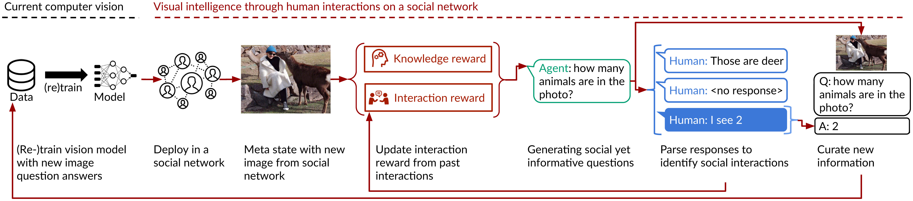

[https://www.pnas.org/doi/10.1073/pnas.2115730119](https://www.pnas.org/doi/10.1073/pnas.2115730119)

> Regardless of how much data artificial intelligence agents have available, agents will inevitably encounter previously unseen situations in real-world deployments. Reacting to novel situations by acquiring new information from other people—socially situated learning—is a core faculty of human development. 
>
> Unfortunately, socially situated learning remains an open challenge for artificial intelligence agents because they must learn how to interact with people to seek out the information that they lack. In this article, we formalize the task of socially situated artificial intelligence—**agents that seek out new information through social interactions with people—as a reinforcement learning problem where the agent learns to identify meaningful and informative questions via rewards observed through social interaction.** 
>
> We manifest our framework as an interactive agent that learns how to ask natural language questions about photos as it broadens its visual intelligence on a large photo-sharing social network. 
>
> Unlike active-learning methods, which implicitly assume that humans are oracles willing to answer any question, **our agent adapts its behavior based on observed norms of which questions people are or are not interested to answer**. Through an 8-mo deployment where our agent interacted with 236,000 social media users, our agent improved its performance at recognizing new visual information by 112%. A controlled field experiment confirmed that our agent outperformed an active-learning baseline by 25.6%. This work advances opportunities for continuously improving artificial intelligence (AI) agents that better respect norms in open social environments.

> To enable socially situated AI, the agent must not only gather data to learn new concepts, but also learn how to interact with people to gather the data. At any given moment, the **agent must trade off between these twin goals of interacting to learn and learning to interact**. The task is made more challenging because the space of possible interactions for the agent to traverse is vast, the space of useful social interactions is a sparse subset of these possible interactions, and the space of informative interactions constantly shifts as the agent learns. Reinforcement learning, which formalizes possible interactions as an action space and feedback as a reward, requires hundreds of millions of interactions to uncover this subspace of informative and prosocial interactions ([17](https://www.pnas.org/doi/10.1073/pnas.2115730119#core-r17), [18](https://www.pnas.org/doi/10.1073/pnas.2115730119#core-r18)); people will abandon such an agent long before it crosses such a threshold ([19](https://www.pnas.org/doi/10.1073/pnas.2115730119#core-r19), [20](https://www.pnas.org/doi/10.1073/pnas.2115730119#core-r20)). As a result of this limitation, methods that learn from human interaction have so far only seen success with manual human labels ([21](https://www.pnas.org/doi/10.1073/pnas.2115730119#core-r21)–[25](https://www.pnas.org/doi/10.1073/pnas.2115730119#core-r25)) or with small action spaces such as games and simulations with only a few dozen moves ([26](https://www.pnas.org/doi/10.1073/pnas.2115730119#core-r26)–[28](https://www.pnas.org/doi/10.1073/pnas.2115730119#core-r28)).

